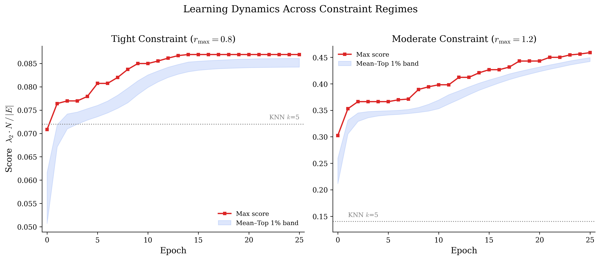
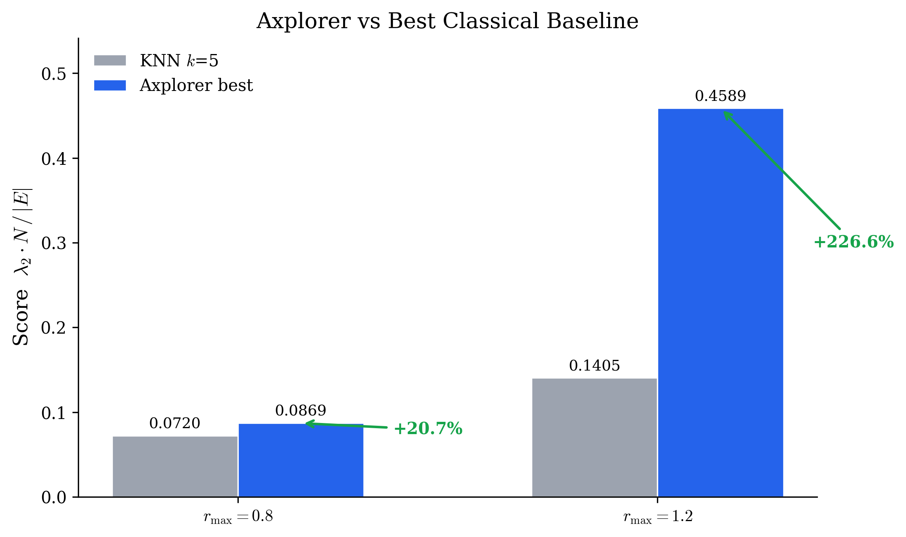

# Geometric Spectral Graph Design via PatternBoost

Maximizing algebraic connectivity per edge on sphere-embedded graphs under geographic distance constraints, using [Axplorer](https://github.com/AxiomMath/axplorer)'s PatternBoost framework.

**[Research Note (PDF)](paper/paper.pdf)** · 14 pages · \$20 of compute · One weekend

---

## Problem

Given $N$ hubs with fixed positions on the unit sphere, find a connected graph $G = (V, E)$ that maximizes:

$$\Phi(G) = \frac{\lambda_2(L_G) \cdot N}{|E|}$$

subject to the geographic constraint (great-circle distance):

$$d(\mathbf{p}_i, \mathbf{p}_j) \leq r_{\max} \quad \forall\; (i,j) \in E$$

This score measures **spectral efficiency** — algebraic connectivity (resilience to partitioning, via the Cheeger inequality) normalized by edge count (cost). The geographic constraint captures the reality that direct connections are only viable within a radius of feasibility.

The problem is an instance of extremal combinatorics with continuous geometric constraints — the geographic embedding breaks all known Ramanujan graph constructions, and the Alon–Boppana bound $\lambda_2(L) \leq d - 2\sqrt{d-1} + o(1)$ establishes a fundamental ceiling that cannot be reached by algebraic methods under distance constraints.

## Results

| Setting | KNN k=5 | Axplorer best | Improvement |
|---------|---------|---------------|-------------|
| Tight constraint (r_max = 0.8, 70 allowed edges) | 0.072 | 0.087 | **+20.7%** |
| Moderate constraint (r_max = 1.2, 140 allowed edges) | 0.141 | 0.459 | **+226%** |



*Left: tight constraint — converged by epoch 14. Right: moderate constraint — still climbing at epoch 25. Dashed lines: KNN k=5 baseline.*



Additional findings:
- Classical random graph generators (Barabási–Albert, Watts–Strogatz, Erdős–Rényi) fail completely under geographic constraints — 84% of edges violate the distance budget
- Simulated annealing achieves higher single-instance scores at N=30 (see paper, Section 4.6) — an honest negative result suggesting the spectral landscape is tractable for classical search at small N
- A 22K-parameter GNN surrogate predicts Fiedler scores with Spearman ρ = 0.963

## Architecture

This project contributes a new **environment** to [Axplorer](https://github.com/AxiomMath/axplorer), Axiom Math's open-source PatternBoost implementation.

**`src/envs/logistics.py`** — The Axplorer environment (~700 lines). Implements `LogisticsDataPoint` with:
- Hub positions sampled uniformly on S² with connectivity guarantee
- Geographic constraint via allowed-edge mask
- Local search: Phase 1 repairs disconnected components via shortest cross-component edge; Phase 2 performs greedy edge swaps for 2N iterations
- Scoring via `numpy.linalg.eigvalsh` (O(N³) eigendecomposition)
- Identical tokenization to Turán environment (`SparseTokenizerSingleInteger`, k=2, symmetric)

**`surrogate/scorer.py`** — A 22,337-parameter Graph Convolutional Network. 4 message-passing layers with residual connections and layer normalization. Node features: (x, y, z, degree). Edge features: great-circle distance. Trained with MSE + pairwise ranking loss. Pure PyTorch, no PyG dependency.

**`benchmarks/`** — Baseline comparison (KNN, BA, WS, ER) and simulated annealing for fair evaluation.

## Quick Start

### Prerequisites

```bash
# Install Axplorer (required for training, not for quick_start demo)
git clone https://github.com/AxiomMath/axplorer.git
cd axplorer && pip install -e . && cd ..

# Install this repo
git clone https://github.com/cpennetier/spectral-graph-patternboost.git
cd spectral-graph-patternboost
pip install -r requirements.txt
```

### Run the demo

```bash
# Quick demo — no GPU, no Axplorer needed, runs in 30 seconds
python examples/quick_start.py

# Run tests
pytest tests/ -v

# Run baselines
PYTHONPATH=. python benchmarks/baseline_comparison.py --N 30 --r_max 0.8
PYTHONPATH=. python benchmarks/simulated_annealing.py --N 30 --r_max 0.8 --sa_runs 20

# Train surrogate (CPU, ~5 minutes)
PYTHONPATH=. python surrogate/train.py --N 30 --r_max 0.8 --num_samples 5000 --epochs 100
```

### Reproduce paper results (requires Axplorer + GPU)

```bash
cd /path/to/axplorer
cp /path/to/spectral-graph-patternboost/src/envs/logistics.py src/envs/
# Add to src/envs/__init__.py: from .logistics import LogisticsEnvironment, LogisticsDataPoint

python train.py --env_name logistics --N 30 --r_max 0.8 \
  --max_epochs 25 --max_steps 5000 --gensize 100000 \
  --pop_size 30000 --num_samples_from_model 100000 \
  --n_layer 4 --n_embd 256 --n_head 8 --batch_size 64 \
  --temperature 0.6 --inc_temp 0.1 --keep_only_unique true \
  --encoding_tokens single_integer --always_search true --num_workers 8
```

Hardware: GCP n1-standard-8 + NVIDIA T4. Training time: ~10 hours. Cost: ~$10 per run.

## Limitations

- All experiments at N=30. Scaling to N=100+ is future work.
- Single random hub layout per constraint regime — no multi-seed variance estimates.
- Simulated annealing outperforms Axplorer on single instances at N=30. Population-based search may show advantages at larger N where the combinatorial space explodes.
- The GNN surrogate provides no wall-clock speedup at N=30 (eigenvalues already take ~37μs). Value emerges at N≥60 where eigendecomposition is O(N³).
- The Fiedler value is a spectral proxy for resilience, not a direct operational metric.

## Citation

```bibtex
@misc{pennetier2026spectral,
  author = {Pennetier, Christophe},
  title = {From Tur\'{a}n to Transport: Extremal Graph Design for Logistics Networks via PatternBoost},
  year = {2026},
  url = {https://github.com/cpennetier/spectral-graph-patternboost}
}
```

## License

MIT — see [LICENSE](LICENSE).
